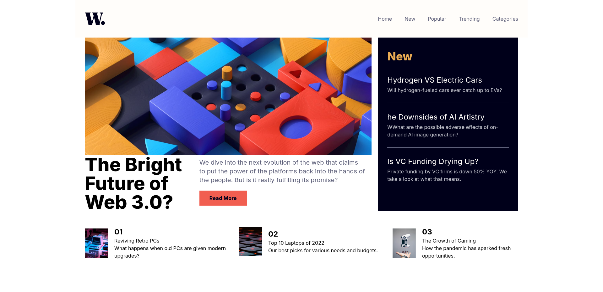

# News Homepage

**A small, responsive React + Vite news homepage (static demo).**

This repository is a frontend-only example built with React, Vite, and Tailwind CSS. It uses local content in `src/content/index.js` (no external API) and demonstrates a clean layout, routing, and a handful of reusable components.

---

## Quick summary (what's in this repo)

* **Framework**: React with Vite
* **Styling**: Tailwind CSS (via `tailwindcss` and `@tailwindcss/vite` plugin)
* **Routing**: `react-router` (client-side routes)
* **Static content**: `src/content/index.js` (articles, nav links, images)
* **Key components**: `Header`, `HeroNews`, `Card`, `NewArticles`, `ReadMoreBtn`

---

## Live demo

This project is intended to run locally. Start the dev server (instructions below) to preview.

---

## Screenshots




---

## Prerequisites

* Node.js 16+ (I recommend Node 18 or newer)
* npm (bundled with Node) or yarn

---

## Install and run locally

1. Install dependencies:

```bash
npm install
# or
# yarn
```

2. Start the dev server:

```bash
npm run dev
```

Vite will print the local URL (usually `http://localhost:5173`). Open it in your browser.

3. Build for production:

```bash
npm run build
```

4. Preview the production build locally:

```bash
npm run preview
```

---

## Available npm scripts

* `npm run dev` — start development server (Vite)
* `npm run build` — build production bundle (output to `dist/`)
* `npm run preview` — preview production build locally
* `npm run lint` — run ESLint across the codebase

(These are taken from `package.json`.)

---

## Project structure (short)

```
news-homepage/
├─ public/                      # static/public assets (design images)
├─ src/
│  ├─ assets/images/            # images and logo used by the UI
│  ├─ components/               # React UI components (Header, Card, HeroNews...)
│  ├─ content/                  # static content used by the app (articles, nav)
│  ├─ pages/                    # route pages (Home, NewArticles, Popular...)
│  ├─ index.css                 # Tailwind import & small custom rules
│  └─ main.jsx                  # app entry + router setup
├─ package.json
├─ vite.config.js
└─ README.md
```

---

## Routing / Pages

The app uses `react-router` with the following routes (see `src/main.jsx` and `src/pages/index.js`):

* `/` — Home (landing, hero + article list)
* `/new` — New articles page
* `/popular` — Popular page
* `/trending` — Trending page
* `/categories` — Categories page

These routes are wired to the components inside `src/pages/`.

---

## Editing content

All the demo article content lives in `src/content/index.js`. To update article text, titles, images, or navigation items:

1. Open `src/content/index.js`.
2. Edit the arrays/objects (for example `hero`, `other`, `newSection`, `navLinks`).
3. If you add/rename images, place them in `src/assets/images/` and import them at the top of `src/content/index.js`.

No backend is required — the content is consumed directly by components.

---

## Components overview

* `Header` — top navigation and mobile hamburger menu (`src/components/Header/Header.jsx`). Uses `navLinks` from `src/content/index.js`.
* `HeroNews` — the large feature story with desktop + mobile thumbnails.
* `Card` — small article card used on the home page.
* `NewArticles` — sidebar list of new items.
* `ReadMoreBtn` — simple CTA button used by the hero.

Look into `src/components/` for the implementation details.

---

## Styling notes

* Tailwind is used via the `@tailwindcss/vite` plugin. The project imports Tailwind using `@import 'tailwindcss';` inside `src/index.css`.
* `index.css` also contains a custom `@custom-variant` for dark mode helpers.

---

## My Future Goals

These are the things I plan to work on next to turn this project into a more complete news app:

* Replace static `src/content` with a real news API (like NewsAPI, GNews, or my own proxy). I’ll set up environment variables for API keys and handle CORS properly.
* Implement pagination or maybe infinite scroll so the article lists feel more real.
* Run a full accessibility audit (axe or Lighthouse) and improve keyboard navigation and ARIA labels where needed.
* Add a fallback image for `Card` components if an image fails to load (`onError`).

---

## Troubleshooting

* **Blank page / missing styles**: ensure `npm install` finished without errors and that `vite` is running. If Tailwind CSS utilities are not applied, check that the `@tailwind` imports are correct.
* **ESLint errors**: run `npm run lint` and fix reported issues, or adjust ESLint config.

---

## License

This project contains a [`LICENSE`](/LICENSE) file (MIT).

---
